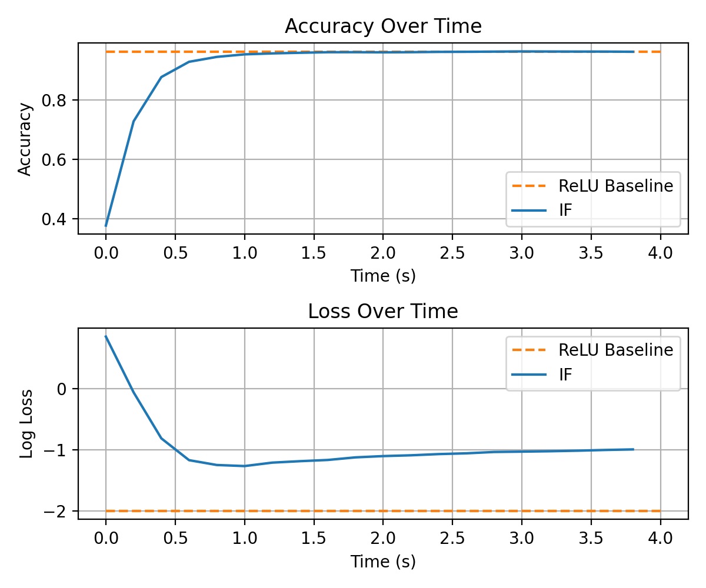

# Spieks

Spieks is a Python library designed for converting Artificial Neural Networks (ANNs) to Spiking Neural Networks (SNNs). This repository contains tools for training ANNs, converting them to SNNs, and evaluating their performance.

## Features

- Train ANNs using PyTorch
- Convert trained ANNs to SNNs
- Evaluate the performance of SNNs

## Installation

To install the required dependencies, run:

```bash
pip install -r requirements.txt
```

## Usage

### Training an ANN

To train an ANN on the MNIST dataset, you can use the provided Jupyter notebook:

```bash
jupyter notebook examples/test_ann2snn.ipynb
```

We recommend substituting `ReLU` with `QCFS`. `QCFS` is a quantization-aware substitute designed to decrease inference latency in spiking networks. Modules may be substituted manually using `swap_layers`:

```python
from spieks.network.converter import swap_layers

model = MNISTModel()
model.load_state_dict(torch.load("mnist.pth", weights_only=True))
swap_layers(model, old_layer_type=nn.ReLU, new_layer_type=QCFS, neuron_args={ "Q": Q })
```

### Converting an ANN to an SNN

The conversion process is demonstrated in the notebook. After training the ANN, you can convert it to an SNN using the `Converter` class:

```python
from spieks.network.converter import Converter
from spieks.neurons import IF

spiking_model = Converter.convert(model, DT, model_subs={ QCFS: IF })
```

### Evaluating the SNN

You can evaluate the performance of the SNN on the MNIST dataset using the `Classifier` class:

```python
from spieks.simulator import Classifier

classifier = Classifier(spiking_model, device=DEVICE)
_activations_, loss, accuracy = classifier.evaluate_dataset(test_loader, duration=T)
print(f"Final Accuracy: {accuracy[-1]}")
```



## Examples

The repository includes a Jupyter notebook with detailed examples of training, converting, and evaluating models. You can find it in the `examples` directory.

## License

This project is licensed under the MIT License.
